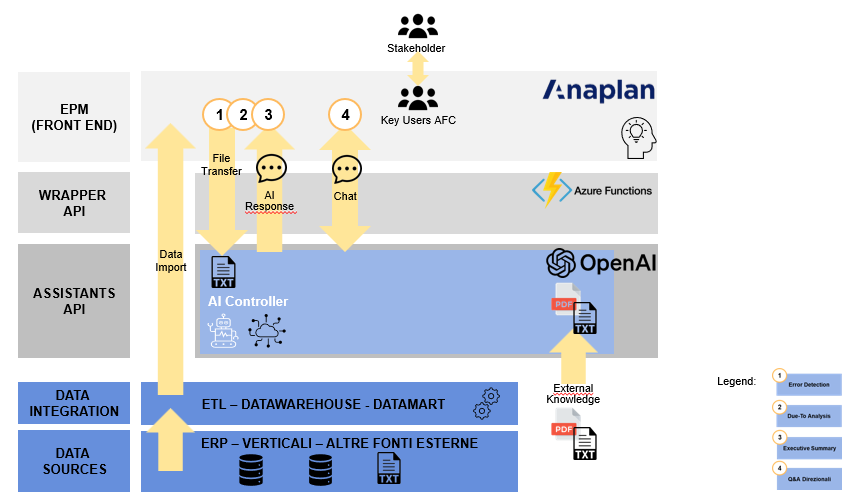

# POC-AI-Controller
Connection between OpenAI and Anaplan to support the AFC function. 

The PoC aims to improve certain aspects that have an impact on the day-to-day activities of the AFC function and that today are very difficult to automate with the existing solution.

The 4 main focuses are:

1. **Error detection**: Detect possible outliers and anomalies in the data.

2. **Due To Analysis**: Perform a "due to" analysis on a large dataset.

3. **Executive summary**: Create a summary from the income statement

4. **Free Q&A**: create a box to allow the controller to ask spot questions.

In this repository there are two .py files:

- *fixed_question.py* (the code to answer question 1, 2 and 3

- *free_questtion.py* (the code to answer question 4)

## Architecture of the project

## Libraries Required

<ul style="list-style-type: square;">
  <li>azure</li>
  <li>requests</li>
  <li>openai</li>
  <li>logging</li>
  <li>datetime</li>
  <li>time</li>
  <li>json</li>
  <li>io</li>
  <li>pandas</li>
  <li>base64</li>
  <li>os</li>
</ul>

## Link to the Webinar
Here the link fot the full webinar with a DEMO [DEMO](https://www.youtube.com/watch?v=PVYbS_iZ-g8&list=PLQ54MGpNOg4BF4Chd7erlprOHiqtnuaGc)
 

